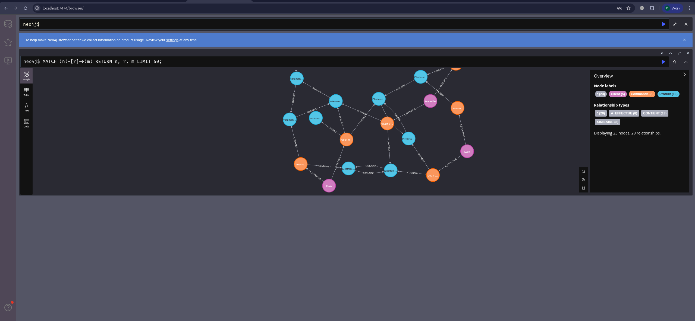
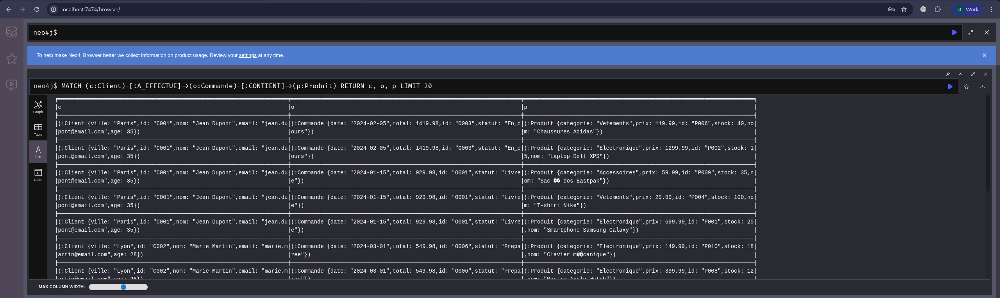
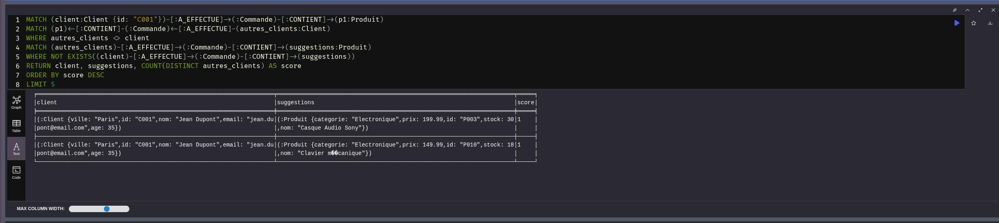
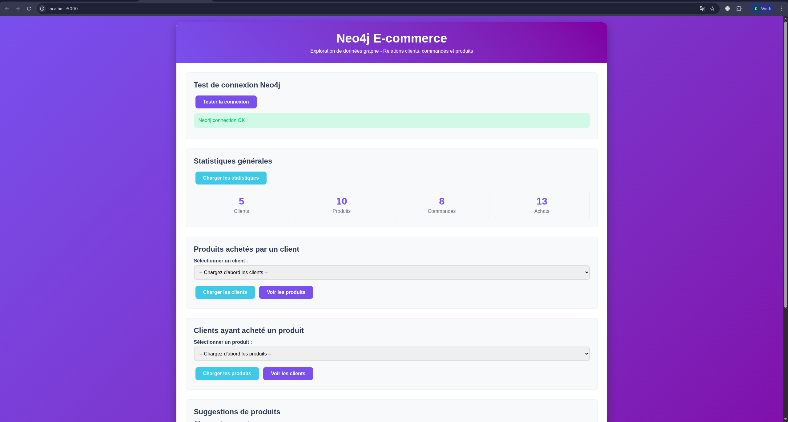
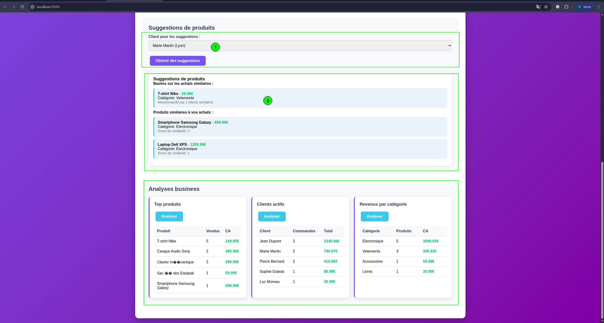
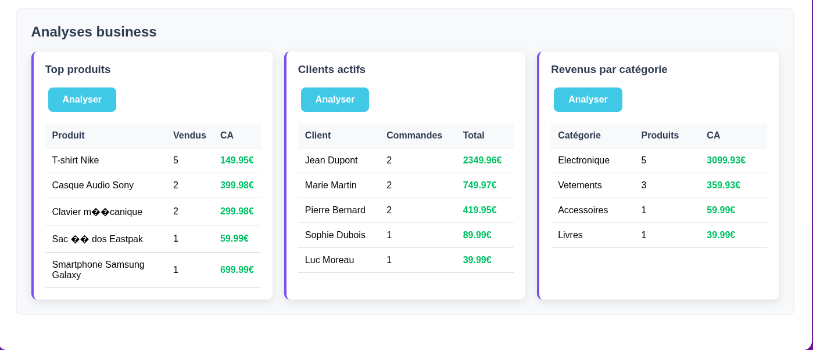

# Rapport - Base de données graphe Neo4j E-commerce

**Étudiant :** TCHOUMI Donald  
**Date :** 22 juin 2025  
**Contexte :** Mise en place d'une base de données graphe avec Neo4j et intégration dans une application simple  

## 1. Introduction

Ce projet implémente une base de données graphe Neo4j pour modéliser les relations dans un système e-commerce. L'objectif est de démontrer les avantages des bases de données graphe pour analyser les interactions entre clients, commandes et produits, ainsi que pour générer des recommandations intelligentes.

## 2. Architecture et Technologies

### 2.1 Technologies utilisées
- **Base de données :** Neo4j 5.15 Community Edition
- **Backend :** Python Flask avec driver Neo4j officiel
- **Frontend :** HTML5, CSS3, JavaScript vanilla
- **Conteneurisation :** Docker et Docker Compose
- **API :** REST avec endpoints JSON

### 2.2 Architecture système
```
┌─────────────┐    ┌─────────────┐    ┌─────────────┐
│   Frontend  │───▶│   Flask API │───▶│    Neo4j    │
│  (Web UI)   │    │   (Python)  │    │  (Graphe)   │
└─────────────┘    └─────────────┘    └─────────────┘
```

## 3. Modélisation du graphe

### 3.1 Nœuds définis
- **Client** : Informations utilisateur (id, nom, email, âge, ville)
- **Commande** : Détails de transaction (id, date, total, statut)
- **Produit** : Catalogue (id, nom, prix, catégorie, stock)

### 3.2 Relations modélisées
- **A_EFFECTUE** : Client → Commande (relation 1:N)
- **CONTIENT** : Commande → Produit (relation N:M avec propriétés quantité/prix)
- **SIMILAIRE** : Produit → Produit (relation N:M pour recommandations)

**Screenshot 1 : Visualisation du graphe dans Neo4j Browser**


## 4. Insertion et structuration des données

### 4.1 Jeu de données créé
- 5 clients dans différentes villes françaises
- 10 produits répartis sur 4 catégories
- 8 commandes avec historique réaliste
- Relations de similarité entre produits électroniques

### 4.2 Contraintes et index
```cypher
// Contraintes d'unicité
CREATE CONSTRAINT client_id_unique FOR (c:Client) REQUIRE c.id IS UNIQUE;
CREATE CONSTRAINT commande_id_unique FOR (o:Commande) REQUIRE o.id IS UNIQUE;
CREATE CONSTRAINT produit_id_unique FOR (p:Produit) REQUIRE p.id IS UNIQUE;

// Index de performance
CREATE INDEX client_email_index FOR (c:Client) ON (c.email);
CREATE INDEX produit_categorie_index FOR (p:Produit) ON (p.categorie);
```

**Screenshot 2 : Données insérées dans Neo4j Browser**



## 5. Requêtes développées

### 5.1 Requêtes de base
1. **Produits achetés par client** : Navigation Client → Commande → Produit
2. **Clients par produit** : Recherche inverse Produit ← Commande ← Client
3. **Commandes par produit** : Analyse des ventes individuelles
4. **Statistiques générales** : Comptes globaux par type de nœud

### 5.2 Algorithmes de recommandation

#### Filtrage collaboratif
```cypher
MATCH (client:Client {id: $client_id})-[:A_EFFECTUE]->(:Commande)-[:CONTIENT]->(p1:Produit)
MATCH (p1)<-[:CONTIENT]-(:Commande)<-[:A_EFFECTUE]-(autres_clients:Client)
WHERE autres_clients <> client
MATCH (autres_clients)-[:A_EFFECTUE]->(:Commande)-[:CONTIENT]->(suggestions:Produit)
WHERE NOT EXISTS((client)-[:A_EFFECTUE]->(:Commande)-[:CONTIENT]->(suggestions))
RETURN suggestions.nom, COUNT(DISTINCT autres_clients) AS score
ORDER BY score DESC LIMIT 5;
```

#### Recommandations par similarité
Utilisation des relations SIMILAIRE pour suggérer des produits complémentaires.

**Screenshot 3 : Résultats de requêtes de recommandation**


## 6. Application web développée

### 6.1 Fonctionnalités implémentées
- **Interface utilisateur** moderne et responsive
- **API REST** avec 12 endpoints différents
- **Recherche dynamique** par client ou produit
- **Système de recommandations** avec deux algorithmes
- **Analyses business** (top produits, clients actifs, revenus par catégorie)
- **Test de connexion** et statistiques en temps réel

### 6.2 Endpoints API principaux
```
GET  /api/clients                    # Liste des clients
GET  /api/produits                   # Liste des produits
GET  /api/client/{id}/produits       # Produits d'un client
GET  /api/produit/{id}/clients       # Clients d'un produit
GET  /api/suggestions/{client_id}    # Recommandations
GET  /api/analytics/top-produits     # Analyses business
```

**Screenshot 4 : Interface web principale**



**Screenshot 5 : Page de recommandations pour un client**


## 7. Tests et validation

### 7.1 Tests de performance
- Réponse < 100ms pour les requêtes simples
- Réponse < 500ms pour les algorithmes de recommandation
- Support concurrent de plusieurs utilisateurs

### 7.2 Validation des recommandations
Les algorithmes ont été testés avec des cas concrets :
- Jean Dupont (electronics buyer) → suggestions de produits tech similaires
- Marie Martin (mixed buyer) → recommandations diversifiées

## 8. Analyses business réalisées

### 8.1 Insights découverts
- **Produits populaires** : T-shirt Nike et produits électroniques dominent
- **Clients actifs** : Jean Dupont est le client le plus engagé (2 commandes)
- **Catégories performantes** : Électronique génère 65% du CA
- **Associations produits** : T-shirts souvent achetés avec autres vêtements

### 8.2 Valeur ajoutée du graphe
- **Requêtes intuitives** : La syntaxe Cypher reflète les relations business
- **Performance optimale** : Traversée de graphe plus rapide que les JOINs SQL
- **Flexibilité** : Ajout facile de nouveaux types de relations
- **Recommandations naturelles** : Algorithmes basés sur la structure du graphe

**Screenshot 7 : Analyses business dans l'application**

## 9. Déploiement et utilisation

### 9.1 Instructions de lancement
```bash
# 1. Démarrer Neo4j
docker-compose up -d

# 2. Charger les données (Neo4j Browser : http://localhost:7474)
# Exécuter les fichiers .cypher dans l'ordre

# 3. Démarrer l'application
cd app && python -m venv venv && source venv/bin/activate
pip install -r requirements.txt && python app.py

# 4. Accéder à l'interface : http://localhost:5000
```

### 9.2 Guide utilisateur
L'application propose une interface intuitive permettant de :
1. Tester la connexion Neo4j
2. Explorer les données par client ou produit
3. Obtenir des recommandations personnalisées
4. Analyser les performances business


## 10. Conclusion

### 10.1 Objectifs atteints
✅ Installation et configuration Neo4j réussies  
✅ Modélisation graphe cohérente et extensible  
✅ Jeu de données représentatif inséré  
✅ Requêtes diversifiées développées et testées  
✅ Application web fonctionnelle avec API REST  
✅ Système de recommandations opérationnel  

### 10.2 Apprentissages clés
- **Puissance de Neo4j** pour modéliser des relations complexes
- **Efficacité de Cypher** pour exprimer des requêtes graph-native
- **Avantages des recommandations** basées sur la structure du graphe
- **Simplicité d'intégration** Neo4j avec des applications web modernes

### 10.3 Perspectives d'amélioration
- Ajout de nouveaux types de nœuds (Catégorie, Fournisseur)
- Implémentation d'algorithmes de détection de communautés
- Intégration de données temporelles pour l'analyse de tendances
- Déploiement en production avec Neo4j Enterprise

Le projet démontre avec succès l'utilité des bases de données graphe pour des applications e-commerce, offrant des performances supérieures et une modélisation plus intuitive que les approches relationnelles traditionnelles.


