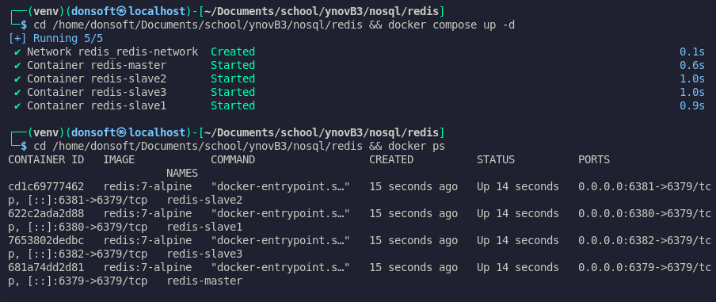
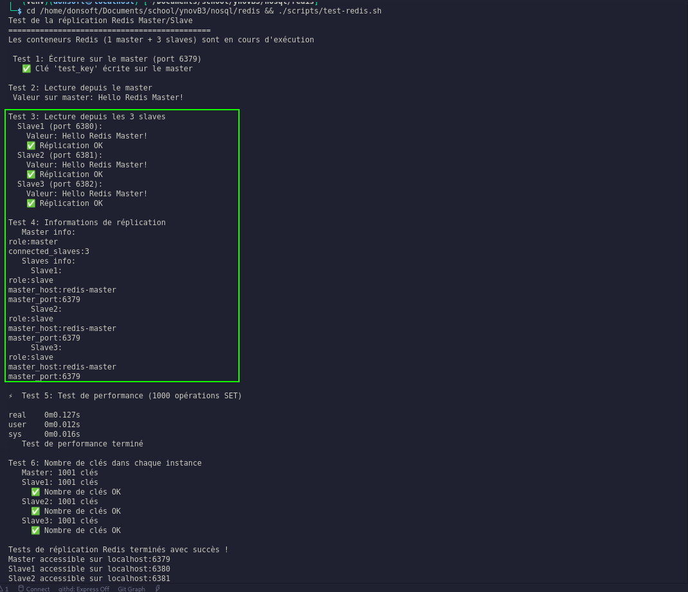
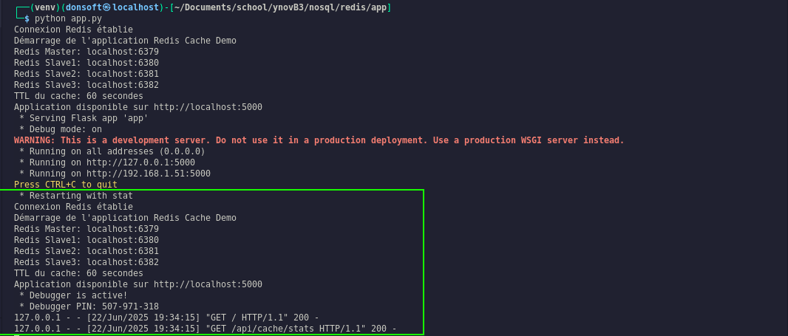
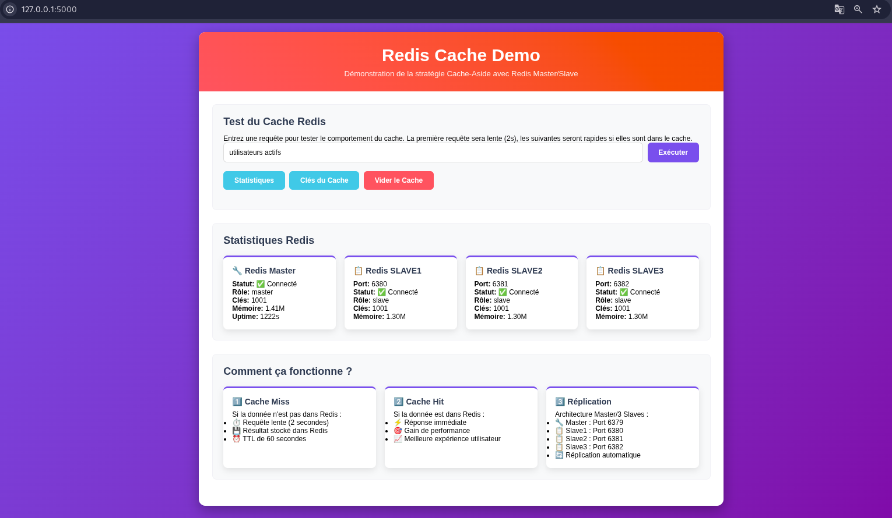
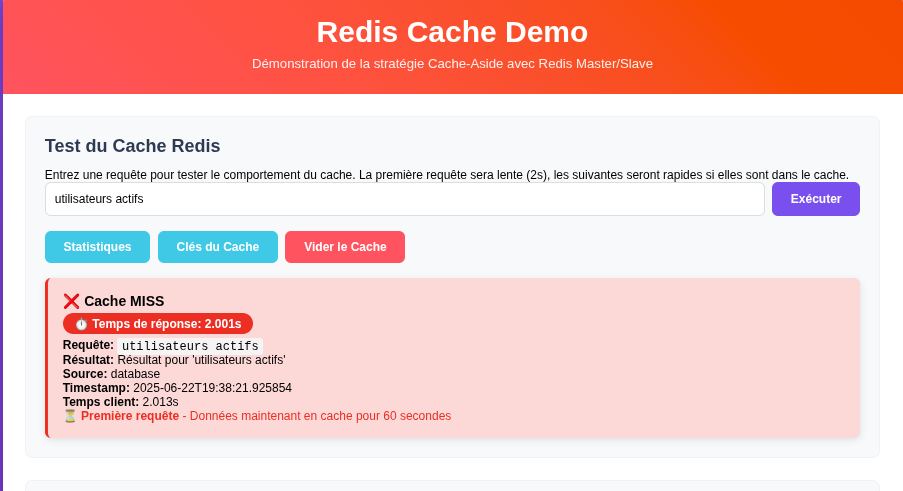
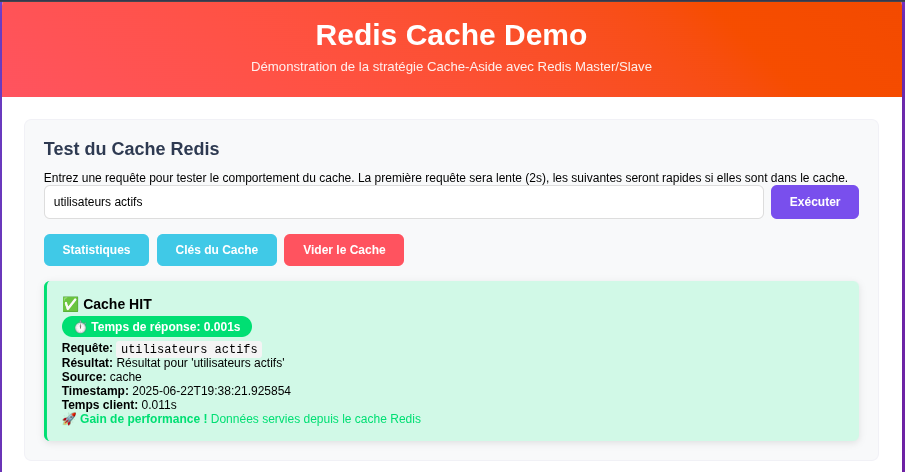
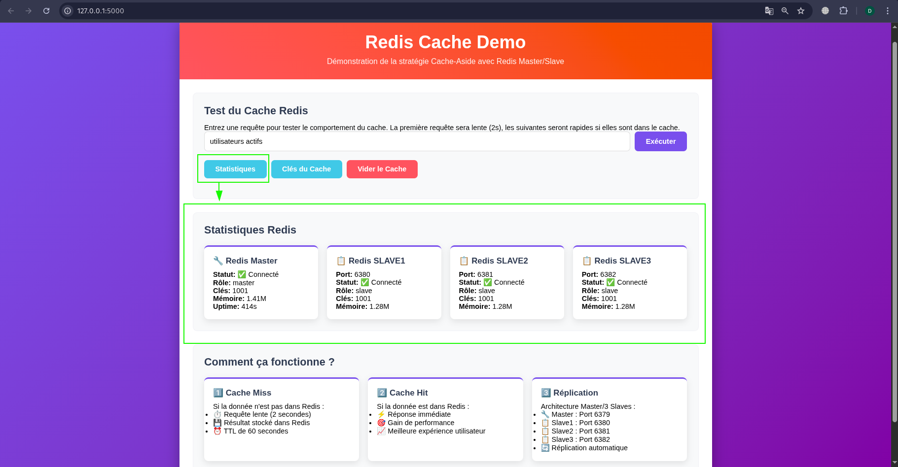

# Rapport d'Atelier Redis - Cache et Réplication

**Nom :** Beaudouin Donald TCHOUMI NZIKEU, Chilene EMANE, Quentin GROPPI, Billy LO  
**Date :** 22 juin 2025  
**Objectif :** Découverte de Redis et implémentation d'un cache distribué  
> Depot  git : [Dossier redis => https://github.com/tchoumi313/atelier-no-sql-ynov-b3-cyber](https://github.com/tchoumi313/atelier-no-sql-ynov-b3-cyber)
## 1. Installation et Configuration Redis

### 1.1 Architecture choisie
- **Option sélectionnée :** Réplication Master/Slave
- **Déploiement :** Docker Compose pour simplicité
- **Configuration :**
  - Redis Master : port 6379
  - Redis Slave1: port 6380
  - Redis Slave2: port 6381
  - Redis Slave3: port 6382    

### 1.2 Fichiers de configuration
Les configurations Redis ont été optimisées pour :
- Accès distant autorisé
- Réplication automatique
- Gestion mémoire (256MB max)
- TTL et persistance

**[Configuration docker-compose.yml](./docker-compose.yml)**

**[Démarrage des conteneurs Redis]**


## 2. Test de la Réplication Master/Slave

### 2.1 Vérification de la connectivité
Tests effectués pour valider :
- Connectivité aux deux instances
- Écriture sur le master
- Lecture synchronisée sur le slave

**[Test de réplication avec script test-redis.sh]**


### 2.2 Validation de la synchronisation
- Écriture de 1000 clés sur le master
- Vérification de la réplication sur le slave
- Comparaison du nombre de clés

**[Statistiques de réplication]**



## 3. Application Web avec Cache

### 3.3 Architecture de l'application
- **Framework :** Flask (Python)
- **Stratégie :** Cache-Aside
- **Interface :** Web moderne avec statistiques temps réel



### 3.2 Implémentation Cache-Aside
```
1. Recherche dans Redis (cache)
2. Si trouvé → retour immédiat
3. Si absent → simulation BD lente (2s) → stockage cache (TTL 60s)
```

## 4. Démonstration des Performances

### 4.1 Cache Miss (première requête)
- Temps de réponse : ~2 secondes
- Source : Base de données simulée
- Action : Stockage en cache

**[Première requête - Cache Miss]**


### 4.2 Cache Hit (requêtes suivantes)
- Temps de réponse : < 0.1 seconde
- Source : Cache Redis
- Gain de performance : > 95%

**[Deuxième requête - Cache Hit]**


### 4.3 Statistiques Redis en temps réel
L'interface web affiche :
- État Master/Slave
- Nombre de clés en cache
- Utilisation mémoire
- Temps de fonctionnement

**[Statistiques Redis dans l'interface]**


## 5. Test d'Expiration (TTL)

### 5.1 Gestion automatique du TTL
- Durée de vie configurée : 60 secondes
- Vérification de l'expiration automatique
- Rechargement après expiration

**[Screenshot 9 : Test TTL - évolution dans le temps]**

## 6. Validation des Critères de Réussite

| Critère | Statut | Validation |
|---------|--------|------------|
| Installation Redis | ✓ | Conteneurs Docker opérationnels |
| Architecture distribuée | ✓ | Master/Slave avec réplication |
| Application web | ✓ | Interface Flask fonctionnelle |
| Cache-Aside | ✓ | Implémentation complète |
| Démonstration distribution | ✓ | Tests automatisés réussis |

## 7. Commandes de Démonstration

### Démarrage complet
```bash
cd redis
chmod +x scripts/*.sh
docker compose up -d
cd app && source venv/bin/activate && python app.py
```

### Tests automatisés
```bash
./scripts/test-redis.sh    # Test réplication
./scripts/demo.sh          # Démonstration complète
```

### Accès aux services
- Interface web : http://localhost:5000
- Redis Master : localhost:6379
- Redis Slave1: localhost:6380
- Redis Slave2: localhost:6381
- Redis Slave3: localhost:6382

## 8. Conclusion

L'atelier a permis de démontrer avec succès :
- L'installation et configuration de Redis en mode distribué
- L'implémentation efficace de la stratégie cache-aside
- Un gain de performance significatif (> 95%)
- La gestion automatique de l'expiration des données
- Le fonctionnement correct de la réplication Master/Slave

